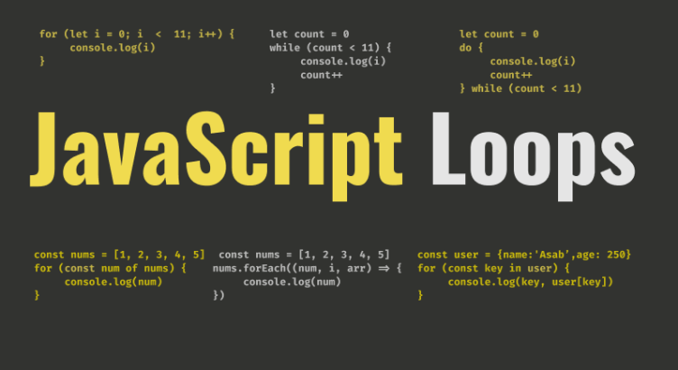

<div align="center">
  <h1> JavaScript Loops</h1>
  <a class="header-badge" target="_blank" href="https://www.linkedin.com/in/asabeneh/">
  
  </a>
  <a class="header-badge" target="_blank" href="https://twitter.com/Asabeneh">
  
  </a>

  <sub>Author:
  <a href="https://www.linkedin.com/in/asabeneh/" target="_blank">Asabeneh Yetayeh</a>
  </sub>

</div>
</div>

<div>

<small>Support [**Asabeneh**](https://www.patreon.com/asabeneh?fan_landing=true) to create more educational materials</small>  
[](https://www.patreon.com/asabeneh?fan_landing=true) 
 
</div>



- [Types of Loops](#types-of-loops)
  - [1. for](#1-for)
  - [2. while](#2-while)
  - [3. do while](#3-do-while)
  - [4. for of](#4-for-of)
  - [5. forEach](#5-foreach)
  - [6. for in](#6-for-in)
- [Intrupting a loop and skipping an item](#intrupting-a-loop-and-skipping-an-item)
  - [break](#break)
  - [continue](#continue)
- [Conclusions](#conclusions)
- [More Materials](#more-materials)

In programming we use different loops to carry out repetitive tasks. Therefore, loop can help us to automate tedious and repetitive task. JavaScript has also different types of loops which we can use to work on repetitive task. 

Imagine if your are asked to print Hello world one thousand times without a loop, it may take an hour or two to do this tedious task. However, using loop we can print it in less than a second.

Loops:

- for
- while
- do while
- for of
- forEach
- for in

A loop use usually goes until the condition gets false. But sometimes we like to intrupt the loop or skip an item during iteration. We use *break* to intrupt the loop  and *continue* to skip an item during iteration.

## Types of Loops

### 1. for

We use for loop when we know how many iteration we go. Let use the following example

```js
// for loop syntax

for (initialization, condition, increment/decrement) {
    code goes here
}
```

This code prints from 0 to 5.

```js

for (let i = 0; i < 6; i++) {
  console.log(i)
}

```

For example if we want to sum all the numbers from 0 to 100.

```js
let sum = 0
for (let i = 0; i < 101; i++) {
  sum += i
}

console.log(sum)

```

If we want to sum only even numbers:

```js
let sum = 0
for (let i = 0; i < 101; i+=2) {
    sum += i
}

console.log(sum)

// or another way

let total = 0
for (let i = 0; i < 101; i++) {
  if(i % 2 == 0) {
    total += i
}
}
console.log(total)
```

This code iterates through the array

```js

const nums = [1, 2, 3, 4, 5]
for (let i = 0; i < 6; i++) {
  console.log(nums[i])
}
```

This code prints 5 to 0. Looping in reverse order

```js
for (let i = 5; i >= 0; i--) {
  console.log(i)
}

```

The Code below can reverse an array.

```js

const nums = [1, 2, 3, 4, 5]
const lastIndex = nums.length - 1
const newArray = []
for (let i = lastIndex; i >= 0; i--) {
   newArray.push(nums[i])
}

console.log(newArray)
```

### 2. while

We use the while loop when we do not know how man iteration we go in advance.

```js
let count = prompt('Enter a positive number: ')
while (count > 0) {
  console.log(count)
  count--
}

```

### 3. do while

Do while run at least once if the condition is true or false

```js
let count = 0
do {
  console.log(count)
  count++
} while (count < 11)

```

The code below runs ones though the condition is false

```js
let count = 11
do {
  console.log(count)
  count++
} while (count < 11)
```

While loop is the least important loop in many programming languages.

### 4. for of

The for of loop is very handy to use it with array. If we are not interested in the index of the array a for of loop is preferable to regular for loop or forEach loop.

```js
const numbers = [1, 2, 3, 4, 5]
for (const number of numbers) {
  console.log(number)
}

const countries = ['Finland', 'Sweden', 'Norway', 'Denmark', 'Iceland']
for (const country of countries ) {
  console.log(country.toUpperCase())
}
```

### 5. forEach

If we are interested in the index of the array forEach is preferable to for of loop. The forEach array method takes a callback function, the callback function takes three arguments: the item, the index and the array itself.

```js
const numbers = [1, 2, 3, 4, 5]
numbers.forEach((number, i) => {
  console.log(number, i)
})

const countries = ['Finland', 'Sweden', 'Norway', 'Denmark', 'Iceland']
countries.forEach ((country, i, arr ) => {
  console.log(i, country.toUpperCase())
})

```

### 6. for in

The for in loop can be used with object literals to get the keys of the object.

```js
const user  =  {
   firstName:'Asabeneh',
   lastName:'Yetayeh',
   age:250,
   country:'Finland',
   skills:['HTML', 'CSS', 'JS', 'React', 'Node', 'Python', 'D3.js']
}


for (const key in user) {
  console.log(key, user[key])
}
```

## Intrupting a loop and skipping an item

### break

Break is used to interrupt a loop.

```js
for(let i = 0; i <= 5; i++){
  if(i == 3){
    break
  }
  console.log(i)
}

// 0 1 2
```

The above code stops if 3 found in the iteration process.

### continue

We use the keyword continue to skip a certain iterations.

```js
for(let i = 0; i <= 5; i++){
  if(i == 3){
    continue
  }
  console.log(i)
}
// 0 1 2 4 5
```

## Conclusions

- Regular for loop can be used anywhere when the number of iteration is known.
- While loop when the number of iteration is not know
- Do while loop and while loop are almost the same but do while loop run at least once even when the condition is false
- for of is used only for array
- forEach is used for array
- for in is used for object  

## More Materials

If you want to dive deep into JavaScript, you can give it a try to the [30DaysOfJavaScript](https://github.com/Asabeneh/30DaysOfJavaScript) challenge. This challenge will take quite long time to finish but you can get all you need about JavaScript

JavaScript  

1. [30DaysJavaScript challenge](https://github.com/Asabeneh/30DaysOfJavaScript)
2. [JavaScript for Everyone](https://github.com/Asabeneh/JavaScript-for-Everyone)
3. [Functional programming in JavaScript](https://github.com/Asabeneh/Functional-Programming-in-JavaScript)
4. [Destructuring in JavaScript](https://github.com/Asabeneh/Destructuring-in-JavaScript)

React  

1. [React for Everyone](https://github.com/Asabeneh/React-For-Everyone)

Python  

1. [30DaysOfPython](https://github.com/Asabeneh/30-Days-Of-Python)

 🎉 CONGRATULATIONS 🎉  

Now, you knew everything you need to know about JavaScript loops.
